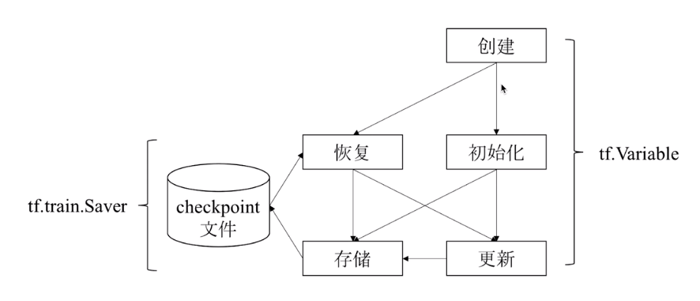

# Variable 变量

变量主要作用是维护特定节点的状态，如深度学习或机器学习的模型参数。

变量是一种特殊的张量，表示模型中的参数，Variable不会随着周期结束而被del掉，以实现模型参数的更新。一般而言，创建的方法是这样的：
```python
w = tf.Variable(<initial-value>, name = <optional-name>)
y = tf.matmul(w, ...another variable or tensor...)
z = tf.sigmoid(w + y)

# 在真正开始运算的时候，总会需要给具体的值
w.assign(w + 1.0)
w.assign_add(1.0)
```

变量的使用流程：

