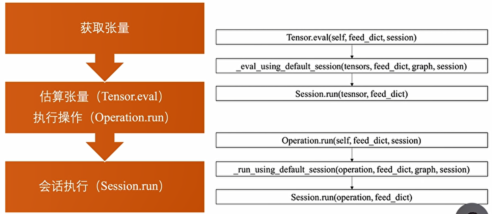
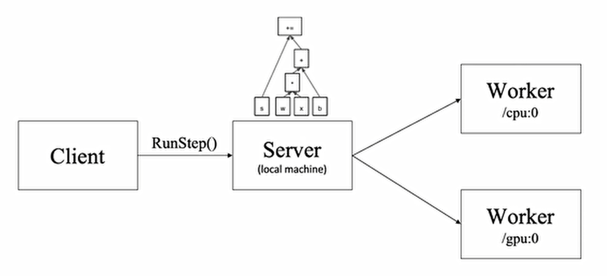

# Session 会话

会话提供了估算张量和执行操作的运行环境，它是发放计算任务的客户端，所有计算任务都由它连接的执行引擎完成。一个会话的典型使用流程分为以下3步：

```python
# target: 会话连接的执行引擎
# graph: 会话加载的数据流图
# config: 会话启动时的配置项
sess = tf.Session(target = ..., graph = ..., config = ...)
sess.run(...)
sess.close()
```

会话执行
获取张量值的另外两种方法：估算张量`Tensor.eval` 与 执行操作 `Operation.run`，这两种方法实际上都是会调用`Session.run()`的方法，具体如下：


当我们调用`sess.run(train_op)`语句进行训练操作的时候：

1. 首先，程序内部提取操作依赖的所有前置操作，这些操作的节点共同组成一幅字图
2. 然后，程序会将子图中的计算节点、存储节点和数据节点按照各自的执行设备分类，相同设备上的节点组成了一幅局部图。
3. 最后，每个设备上的局部图在实际执行时，根据节点间的依赖关系将各个节点有序地加载到设备上执行。

会话本地执行：
对于单机程序来说，相同机器上不同编号的CPU或者GPU就是不同的设备，我们可以在创建节点时指定执行该节点的设备
```python
with tf.device("/cpu:0):
    v = tf.Variable(...)

with tf.device("/gpu:0"):
    z = tf.matmul(x, y)
```

简单概括就是：

